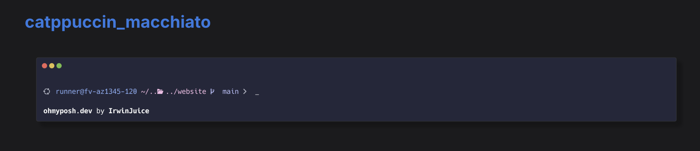

# catpuccin-kali-theme.zsh-theme
This is a theme inspired from oh-my-posh catpuccin-"flavor" theme for oh-my-zsh. 

### This is how it looked on the oh-my-posh theme list :

### This is my approach to recreate it for oh-my-zsh :

I used my own dark mode color theme, you may change them how you want, instructions are commented in the code also. I harcoded the ubuntu logo for me, well because i like the logo. looks like sharingan. haha.  

> URL for ICONS : https://www.nerdfonts.com/cheat-sheet [just copy the icons]

> for-color-codes: for code in {000..255}; do print -P -- "$code: %F{$code}Color%f"; done

> example: %{$FG[050]%}
